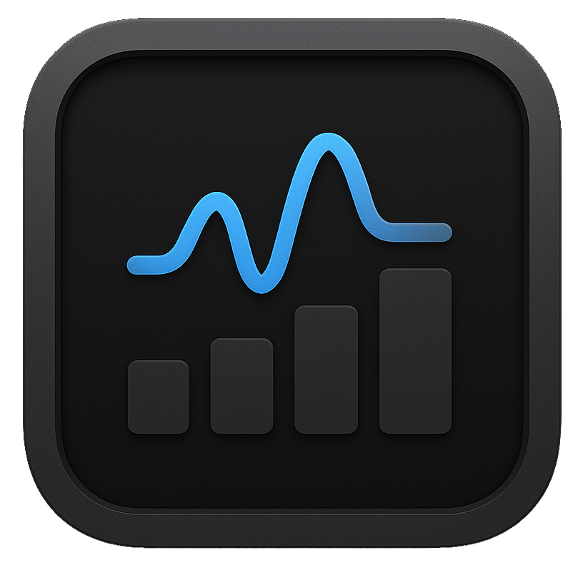

# NanoStats
<h1 align="center">
   
</h1>
A lightweight macOS status bar utility for monitoring system resources.

## Features

- ✅ RAM Usage - Shows memory usage with detailed breakdown
- ✅ Process List - Displays top memory-consuming processes
- ✅ PID Information - Hover over processes to see their PIDs
- ✅ Compact Display - Small footprint in your menu bar
- ❌ CPU Usage - Not implemented yet
- ❌ Network Usage - Not implemented yet

## Installation

1. Download the latest release from the Releases page
2. Move NanoStats.app to your Applications folder
3. Launch NanoStats

## Usage

TBD
